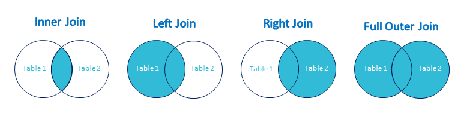

## Basic SQL Queries

### 1. create table 
```
IF OBJECT_ID('[dbo].[employee]', 'U') IS NOT NULL
DROP TABLE [dbo].[employee]
GO

CREATE TABLE [dbo].[employee]
(
    ID INT NOT NULL PRIMARY KEY,
    Name NVARCHAR(50) NOT NULL,
    Type NVARCHAR(50) NOT NULL,
    Profession NVARCHAR(200) NOT NULL,
);
GO
```

### 2. SELECT ( Read data )
```
SELECT * FROM employee;
SELECT FROM WHERE ORDER BY GROUP BY HAVIN.G LIMIT
```

### 3. INSERT 
```
INSERT INTO VALUES

INSERT INTO dbo.employee (ID, Name, Type, Profession)
VALUES 
(2, 'Shubham', 'Text', 'Writer'),
(3, 'hublal', 'Text', 'Nothing')
```

### 4. UPDATE
```
UPDATE tableName SET columnNmae = 0;
UPDATE tableName SET columnNmae = 0 WHERE userID = 123;
```

### 5. DELETE
```
DELETE FROM tableName WHERE ID = 123;  ==>> that row will be delete 
```

## Advanced SQL Queries

### 1. JOINS


```
========== INNER JOIN ==========
SELECT column_name FROM tableA
INNER JOIN tableB
ON tableA.commonColumn = tableB.commonColumn;

========== LEFT JOIN ==========
SELECT column_name FROM tableA
LEFT JOIN tableB
ON tableA.commonColumn = tableB.commonColumn;

========== RIGHT JOIN ==========
SELECT column_name FROM tableA
RIGHT JOIN tableB
ON tableA.commonColumn = tableB.commonColumn;

========== FULL OUTER JOIN ==========
SELECT column_name FROM tableA
FULL OUTER JOIN tableB
ON tableA.commonColumn = tableB.commonColumn;

========== SELF JOIN ==========     =>    It is used to comparing values in a column with the same table
SELECT column_name FROM tableA
JOIN tableA
ON tableA.column_name = tableA.column_name;
```

### 2. Subqueries or inner or nested queries
Subqueries is a query within another query

```
SELECT column_name FROM tableA
WHERE column_name operator ( SELECT column_name from tableName WHERE id = 123; )   

here the bracket query is the Subquery
```

### 3. CTEs (Common Table Expressions)
* it helps the query optimization
* a temporary table stored inside the CTE 
```
SELECT column1, column2, ...
FROM CTE_name
WHERE condition;
```

### 4. UNION and UNION ALL

#### UNION
it is used to combined data from 2 or more tables and it will return the unique data 
condition ==>
* same number columns
* same data type
* same order

```
SELECT col_name FROM TabelA
UNION
SELECT col_name FROM TabelA
```

#### UNION ALL
it is used to combined data from 2 or more tables and it will return the all data along with duplicate
condition ==>
* same number columns
* same data type
* same order

```
SELECT col_name FROM TabelA
UNION ALL
SELECT col_name FROM TabelA
```


